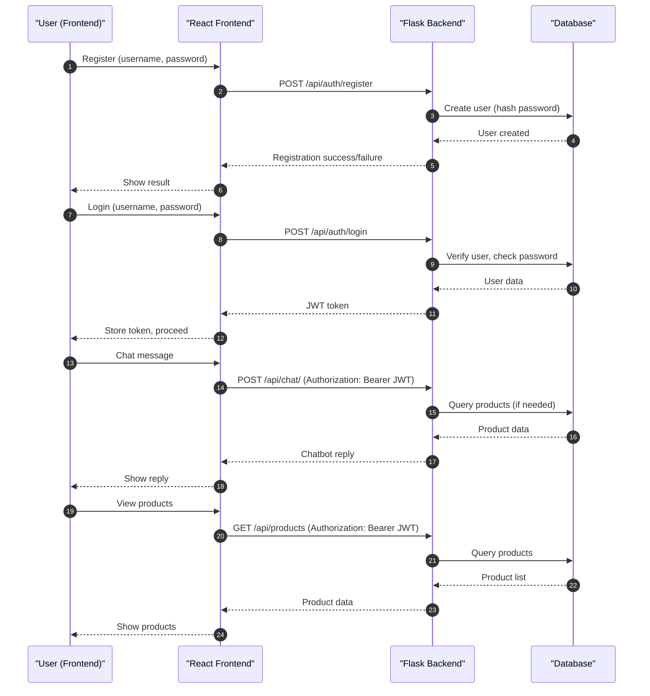

# E-commerce Sales Chatbot

[](https://github.com/alexroygh/ecommerce-chatbot/actions/workflows/backend-tests.yml)
[](https://github.com/alexroygh/ecommerce-chatbot/actions/workflows/frontend-tests.yml)
[](https://alexroygh.github.io/ecommerce-chatbot/)
[](https://ecommerce-chatbot-55e9.onrender.com/health)


The badges above show the current status of the test suites and deployments for each part of the project. Click a badge to view the latest workflow runs or visit the live deployment. 

A full-stack project featuring a modern e-commerce chatbot with product search, exploration, and purchase simulation.

## Live Deployments

- **Frontend (GitHub Pages):** [https://alexroygh.github.io/ecommerce-chatbot/](https://alexroygh.github.io/ecommerce-chatbot/)
- **Backend (Render.com):** [https://ecommerce-chatbot-55e9.onrender.com/](https://ecommerce-chatbot-55e9.onrender.com/)
- - Note: Backend uses a free instance which will spin down with inactivity, which can delay requests by 50 seconds or more.


## Continuous Integration (CI)

This project uses [GitHub Actions](https://github.com/alexroygh/ecommerce-chatbot/actions) for continuous integration:

- **Backend Tests**: Runs all backend Python tests and coverage on every push and pull request.
- **Frontend Tests**: Runs all frontend Node.js/React tests and coverage on every push and pull request.


## Tech Stack
- Frontend: React, TailwindCSS
- Backend: Python Flask, SQLite (SQLAlchemy)
- Auth: JWT (JSON Web Token)

## User Management

### Registration & Login
- Users register with a **unique username** and **password** via the `/api/auth/register` endpoint.
- On registration, the password is **hashed** using industry-standard hashing (Werkzeug) before being stored in the database. **Plaintext passwords are never stored.**
- On login (`/api/auth/login`), the submitted password is checked against the stored hash.
- If authentication is successful, a JWT token is issued to the user for subsequent requests.

### User Data Model
- Each user has:
  - `id`: Unique integer identifier
  - `username`: Unique string (must be unique in the system)
  - `password_hash`: Secure hash of the user's password

### Authentication Flow
1. **Register:** User provides a username and password. The backend checks for uniqueness, hashes the password, and stores the user.
2. **Login:** User provides credentials. The backend verifies the password against the hash and issues a JWT if valid.
3. **Session:** The frontend stores the JWT and uses it for all authenticated API requests.
4. **Security:** Passwords are never returned to the frontend or stored in plaintext. All authentication is stateless and token-based.

---

## API Sequence Diagram



---

## Authentication Strategy

### Overview
- **JWT-based authentication** is used for all secure endpoints.
- The system does **not** use cookies or server-side sessions for authentication.

### How It Works
1. **Login:**
   - The user submits their username and password to `/api/auth/login`.
   - If credentials are valid, the backend issues a JWT (JSON Web Token) in the response body.
2. **Token Storage:**
   - The frontend (React) stores the JWT in `localStorage` (never in cookies).
   - This means authentication is stateless and not tied to a browser session or server memory.
3. **Authenticated Requests:**
   - For all protected API calls (e.g., `/api/chat/`, `/api/products`), the frontend attaches the JWT in the `Authorization` header as:
     ```
     Authorization: Bearer <token>
     ```
   - The backend validates the JWT on every request using Flask-JWT-Extended.
4. **Logout:**
   - Logging out simply removes the JWT from `localStorage` on the client side.
   - No server-side session needs to be invalidated.

### Why JWT?
- **Stateless:** No server memory or session storage is required; all user info is encoded in the token.
- **Scalable:** Works well for distributed systems and APIs.
- **Secure:** As long as the token is kept secret and not exposed in URLs or cookies, it is secure against CSRF and session fixation.
- **Frontend Flexibility:** The frontend can store the token however it wants (here, in `localStorage`).

### Security Notes
- JWTs are only sent over HTTPS in production to prevent interception.
- Tokens are never stored in cookies, so CSRF is not a concern.
- The backend checks the token's validity and expiration on every request.

---

## Project Structure
- `backend/` - Flask API, database, and models
- `frontend/` - React app with chatbot UI

## Setup Instructions

**Important:**
- Before running the backend server for the first time (or after changing models), you must initialize the database:
  ```bash
  cd backend
  python seed_db.py
  ```
- If you see an error like `no such table: user`, it means the database is not initialized. Run the above command and restart the server.

See `backend/README.md` and `frontend/README.md` for details.

---

## Features
- Secure login/authentication
- Chatbot interface for product search and purchase
- Mock inventory with 100+ products
- Chat history and session management
- Responsive UI

---

## Documentation
- See `project_report.md` for architecture, tech choices, and learnings. 