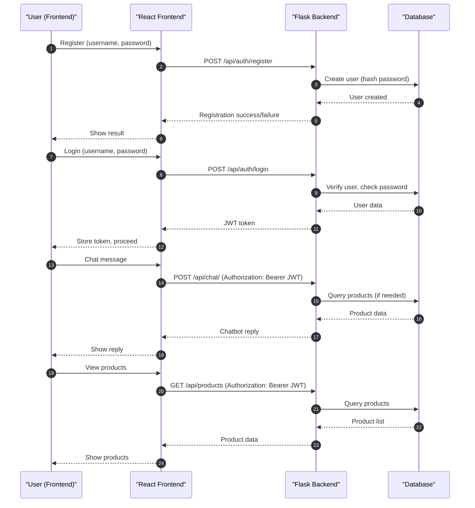

# E-commerce Sales Chatbot

[](https://github.com/alexroygh/ecommerce-chatbot/actions/workflows/backend-tests.yml)
[](https://github.com/alexroygh/ecommerce-chatbot/actions/workflows/frontend-tests.yml)
[](https://alexroygh.github.io/ecommerce-chatbot/)
[](https://ecommerce-chatbot-55e9.onrender.com/health)

The badges above show the current status of the test suites and deployments for each part of the project. Click a badge to view the latest workflow runs or visit the live deployment. 

A full-stack project featuring a modern e-commerce chatbot with product search, exploration, and purchase simulation.

---

<div>
  <a href="https://www.loom.com/share/0ebc52cd81824cf7a9f61330e170c915">
    <p>Loom | Free Screen & Video Recording Software | Loom - 24 June 2025 - Watch Video</p>
  </a>
  <a href="https://www.loom.com/share/0ebc52cd81824cf7a9f61330e170c915">
    
  </a>
</div>

# Project Overview
This project is a full-stack e-commerce chatbot platform involving a conversational interface. The system is built with a modern, modular architecture, featuring a React frontend and a Python Flask backend, with JWT-based authentication and a mock inventory of 50 products and 2 test users.

---

## Live Deployments
- **Frontend (GitHub Pages):** [https://alexroygh.github.io/ecommerce-chatbot/](https://alexroygh.github.io/ecommerce-chatbot/)
- **Backend (Render.com):** [https://ecommerce-chatbot-55e9.onrender.com/apidocs](https://ecommerce-chatbot-55e9.onrender.com/apidocs)
- Note: Backend uses a free instance which will spin down with inactivity, which can delay requests by 50 seconds or more.

---

## Sample Test Users

You can use the following test users to log in and try out the app:

- **Username:** test1  |  **Password:** test123
- **Username:** test2  |  **Password:** test123

---

## Sample Queries
- **"Show me electronics"**
- **"Find books"**
- **"Do you have tennis equipment?"**
- **"Show some toys"**

---

## Architecture Overview

### High-Level Diagram
- **Frontend (React + TailwindCSS):**
  - Responsive UI for desktop, tablet, and mobile
  - Chatbot interface with session management, chat history, and product visualization
  - Login and registration with JWT session management
  - Product explorer with search and filter
- **Backend (Flask + SQLAlchemy + JWT):**
  - RESTful API for authentication, product search, and chat
  - SQLite database with 50 mock products and 2 test users
  - JWT-based authentication and session management
  - Simple keyword-based chatbot logic

### Component Diagram
- **Frontend:**
  - `App.js`: Routing and context
  - `AuthContext.js`: Auth/session management
  - `pages/`: Login, Register, Chatbot, Products
- **Backend:**
  - `app.py`: App factory, blueprint registration
  - `models.py`: User and Product models
  - `auth.py`: Auth endpoints
  - `products.py`: Product endpoints
  - `chat.py`: Chatbot endpoint
  - `seed_db.py`: Database seeding

---

## Tech Stack & Rationale
- **Frontend:**
  - **React:** Component-based, fast, and widely adopted for SPAs
  - **TailwindCSS:** Utility-first CSS for rapid, responsive design
  - **Axios:** Promise-based HTTP client for API calls
  - **React Router:** Declarative routing for SPA navigation
- **Backend:**
  - **Flask:** Lightweight, modular, and easy to extend for REST APIs
  - **Flask-JWT-Extended:** Secure, stateless authentication
  - **Flask-SQLAlchemy:** ORM for easy database management
  - **Flask-CORS:** Cross-origin resource sharing for frontend-backend integration
  - **Flask-Migrate:** Database migrations management
  - **SQLite:** Simple, file-based RDBMS for mock/demo data
- **Design Patterns:**
  - **Blueprints (Flask):** Modular separation of API concerns
  - **Context (React):** Centralized auth/session state
  - **Separation of Concerns:** Clear split between UI, API, and data layers

---

## API Endpoints
Full Swagger api docs here: [https://ecommerce-chatbot-55e9.onrender.com/apidocs](https://ecommerce-chatbot-55e9.onrender.com/apidocs).
For protected endpoints (e.g., /api/chat), click the "Authorize" button and enter your JWT token as:
  ```
  Bearer <your-access-token>
  ```
- `POST /api/auth/register` — Register a new user
- `POST /api/auth/login` — Login and receive JWT
- `GET /api/products` — List/search products (supports `search` and `category` query params)
- `POST /api/chat` — Send a message to the chatbot (JWT required)

---

## Continuous Integration (CI)
This project uses [GitHub Actions](https://github.com/alexroygh/ecommerce-chatbot/actions) for continuous integration:
- **Backend Tests**: Runs all backend Python tests and coverage on every push and pull request.
- **Frontend Tests**: Runs all frontend Node.js/React tests and coverage on every push and pull request.

---

## User Management
### Registration & Login
- Users register with a **unique username** and **password** via the `/api/auth/register` endpoint.
- On registration, the password is **hashed** using industry-standard hashing (Werkzeug) before being stored in the database. **Plaintext passwords are never stored.**
- On login (`/api/auth/login`), the submitted password is checked against the stored hash.
- If authentication is successful, a JWT token is issued to the user for subsequent requests.

### User Data Model
- Each user has:
  - `id`: Unique integer identifier
  - `username`: Unique string (must be unique in the system)
  - `password_hash`: Secure hash of the user's password

### Authentication Flow
1. **Register:** User provides a username and password. The backend checks for uniqueness, hashes the password, and stores the user.
2. **Login:** User provides credentials. The backend verifies the password against the hash and issues a JWT if valid.
3. **Session:** The frontend stores the JWT and uses it for all authenticated API requests.
4. **Security:** Passwords are never returned to the frontend or stored in plaintext. All authentication is stateless and token-based.

---

## API Sequence Diagram


---

## Authentication Strategy
### Overview
- **JWT-based authentication** is used for all secure endpoints.
- The system does **not** use cookies or server-side sessions for authentication.

### How It Works
1. **Login:**
   - The user submits their username and password to `/api/auth/login`.
   - If credentials are valid, the backend issues a JWT (JSON Web Token) in the response body.
2. **Token Storage:**
   - The frontend (React) stores the JWT in `localStorage` (never in cookies).
   - This means authentication is stateless and not tied to a browser session or server memory.
3. **Authenticated Requests:**
   - For all protected API calls (e.g., `/api/chat/`, `/api/products`), the frontend attaches the JWT in the `Authorization` header as:
     ```
     Authorization: Bearer <token>
     ```
   - The backend validates the JWT on every request using Flask-JWT-Extended.
4. **Logout:**
   - Logging out simply removes the JWT from `localStorage` on the client side.
   - No server-side session needs to be invalidated.

### Why JWT?
- **Stateless:** No server memory or session storage is required; all user info is encoded in the token.
- **Scalable:** Works well for distributed systems and APIs.
- **Secure:** As long as the token is kept secret and not exposed in URLs or cookies, it is secure against CSRF and session fixation.
- **Frontend Flexibility:** The frontend can store the token however it wants (here, in `localStorage`).

### Security Notes
- JWTs are only sent over HTTPS in production to prevent interception.
- Tokens are never stored in cookies, so CSRF is not a concern.
- The backend checks the token's validity and expiration on every request.

---

## Project Structure
- `backend/` - Flask API, database, and models
- `frontend/` - React app with chatbot UI

---

## Features
- Secure login/authentication
- Chatbot interface for product search and purchase
- Mock inventory with 100+ products
- Chat history and session management
- Responsive UI

---

## Challenges & Solutions
- **Session Management:**
  - Used JWT for stateless, secure sessions; React context for client-side state
- **Mock Data Generation:**
  - Automated script (`seed_db.py`) to generate 100+ products with random categories, prices, and stock
- **Chatbot Logic:**
  - Implemented simple keyword-based search for demo; can be extended with NLP or LLMs
- **Responsive UI:**
  - TailwindCSS enabled rapid, mobile-friendly design
- **Error Handling:**
  - User feedback for login errors, API failures, and empty search results

---

## Setup & Execution Instructions
### Backend
1. `cd backend`
2. Create and activate a virtual environment (conda can be used)
3. `pip install -r requirements.txt`
4. `flask db upgrade` (to initialize the database schema)
5. `python seed_db.py` (to seed the database)
6. `flask run`

### Frontend
1. `cd frontend`
2. `npm install`
3. `npm start`

### Usage
- Register a new user, login, and start chatting or exploring products.
- All chat and product interactions are stored for session continuity.

---

## Running Backend Tests

To run the backend tests, make sure you have installed the requirements:

```bash
pip install -r requirements.txt
```

Then run:

```bash
pytest
```

This will automatically discover and run all tests in the backend directory.

For coverage report:

```bash
pytest --cov=.
```

---

## Running Frontend Tests

To run the frontend tests, first install dependencies:

```bash
cd frontend
npm install
```

Then run:

```bash
npm test
```

This will run all tests in the `frontend/src/pages/__tests__/` directory and any other test files in the frontend.

---

## Accessing the Database (SQLite)

You can inspect the database and view tables using the `sqlite3` command-line tool:

1. Open a terminal and navigate to the backend directory:
   ```bash
   cd backend
   ```
2. Open the database:
   ```bash
   sqlite3 ../instance/ecommerce.db
   ```
3. List all tables:
   ```sql
   .tables
   ```
4. View the schema for a table (e.g., `user`):
   ```sql
   .schema user
   ```
5. Query data from a table (e.g., `chat_message`):
   ```sql
   SELECT * FROM chat_message;
   SELECT * FROM product;
   SELECT * from user;
   ```
6. Exit sqlite3:
   ```sql
   .exit
   ```

---
